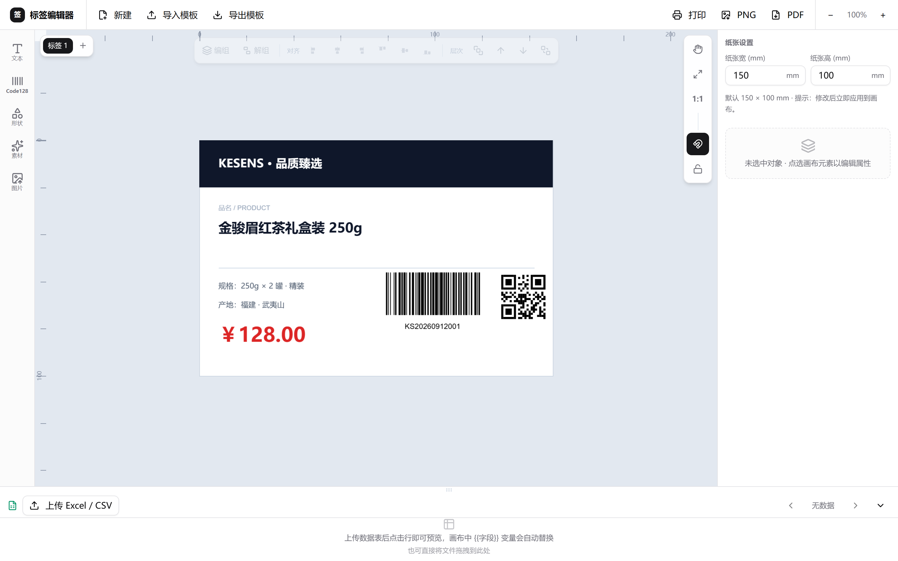
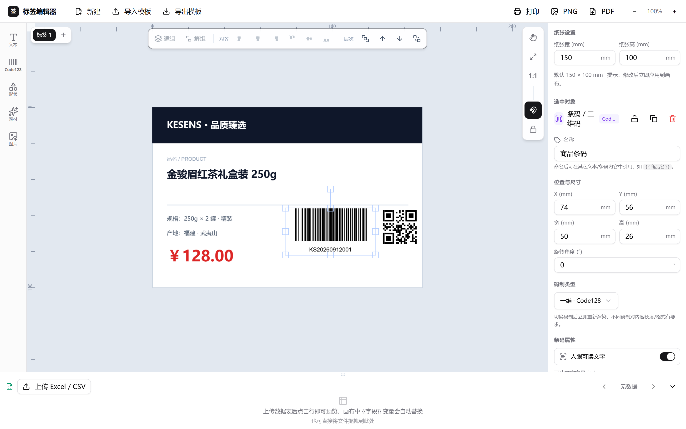
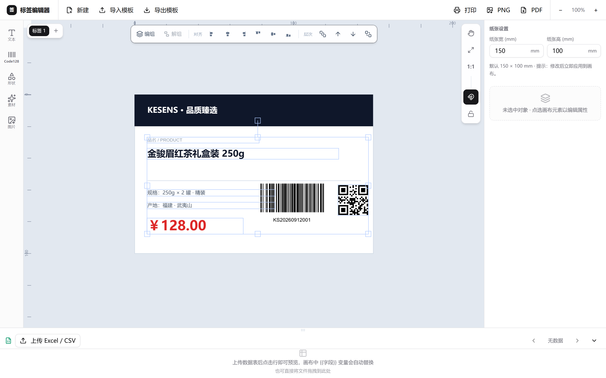
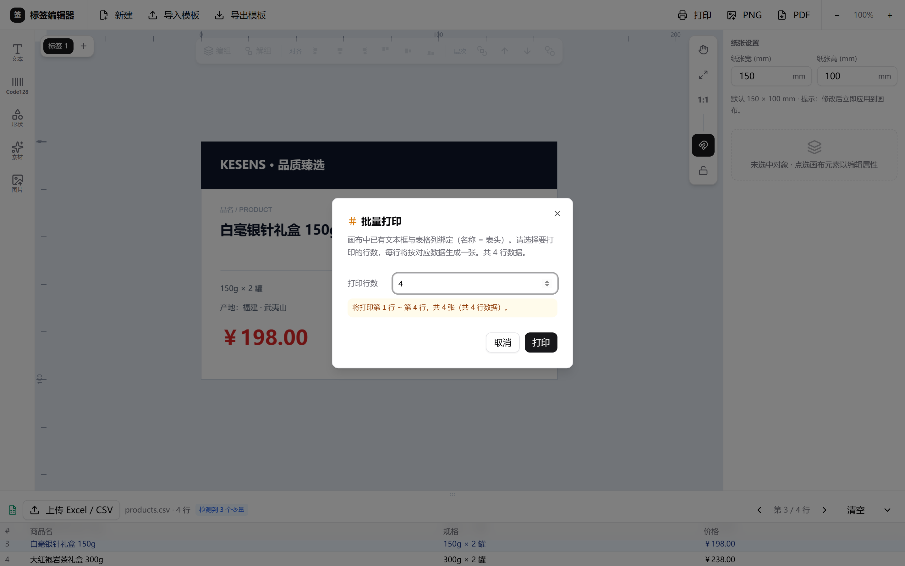
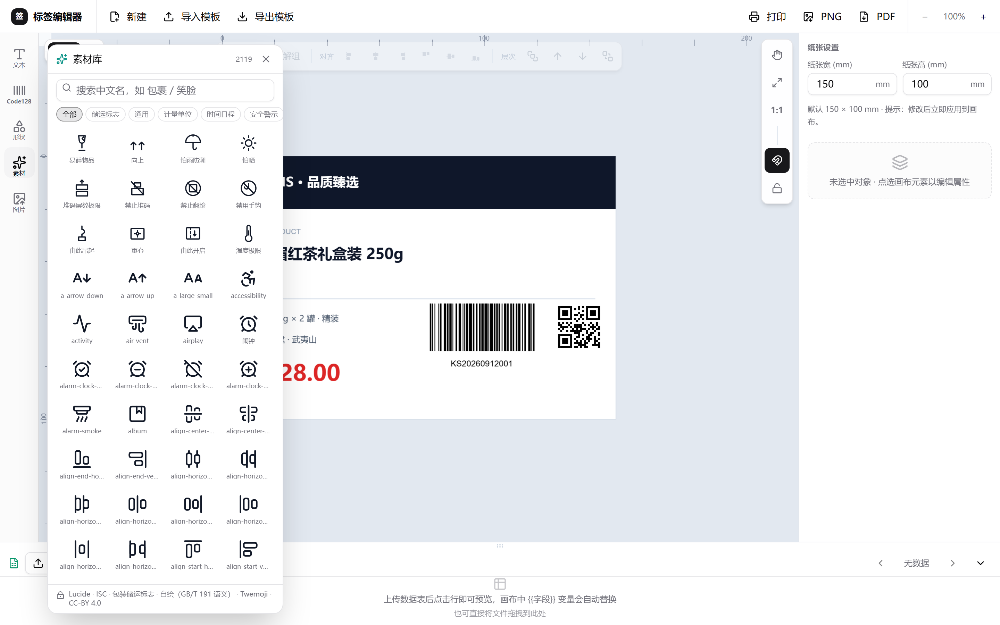
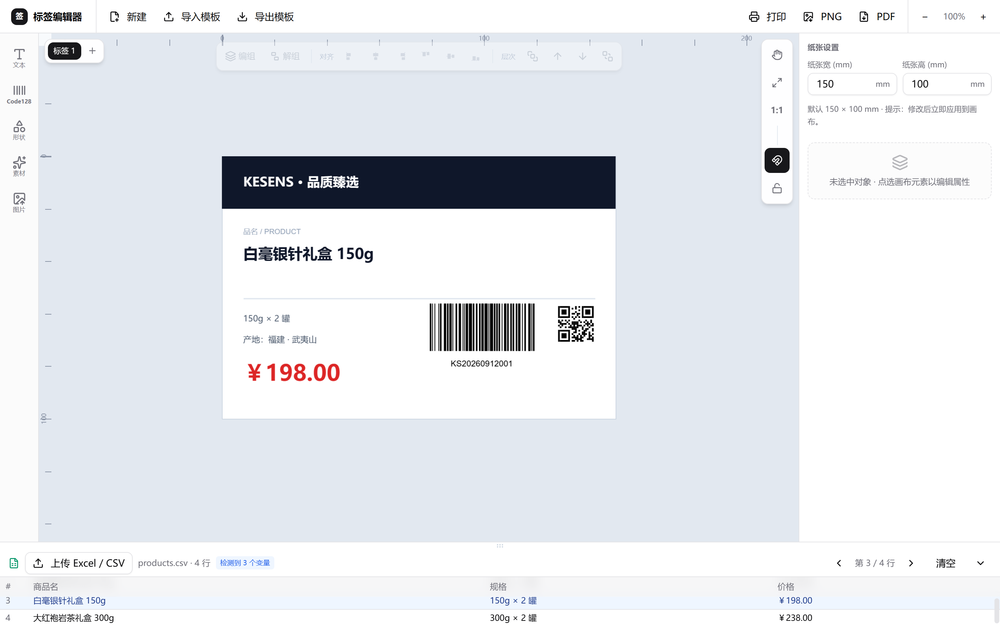
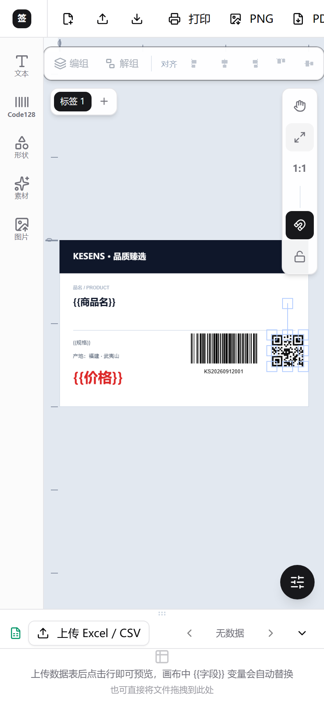

# 标签编辑器 · Label Editor

一个**单文件标签 / 不干胶 / 条码标签**可视化编辑器：在浏览器里拖拽排版文本、形状、图片与矢量条码，所见即所得地设计标签，并导出为 **PDF（矢量）/ PNG** 或批量打印。

> 🔗 在线演示：<http://057300.xyz/label-editor/>



<p align="center">
  <sub>三栏式编辑器：左侧工具箱 · 中间无限画布 · 右侧属性面板 · 底部数据栏</sub>
</p>

---

## ✨ 功能特性

| 类别 | 能力 |
| --- | --- |
| **画布** | 无限画布、CSS 视口缩放、滚轮以光标为中心缩放、中键拖动平移、双击中键「适应画布」 |
| **标尺** | 顶部 / 左侧纸张标尺，步长按缩放自动分级（1 / 5 / 10 / 20 mm）；选中对象时在标尺上投影高亮带并标注宽高（mm） |
| **历史** | 撤销 / 重做，40 步历史栈；快捷键 Ctrl+Z / Ctrl+Shift+Z（或 Ctrl+Y），顶部按钮实时反映可用状态 |
| **对象** | 文本、矩形、椭圆、直线、图片、条码、二维码 |
| **条码** | Code128 / Code39 / EAN(EAN-13) / UPC / DataMatrix / QR，**矢量矩形组**渲染（扫码可用），二维码支持容错等级 **L / M / Q / H** |
| **素材** | 内置 **2100+** 个矢量线稿图标（Lucide / 自绘包装储运标志 / Twemoji），按分类与关键词检索，插入后可改色与描边粗细 |
| **数据** | 上传 Excel / CSV，**文本框名称与表头同名即自动绑定整列**，按行预览、批量套打与批量导出 |
| **多选编排** | 6 种对齐（左/水平居中/右/上/垂直居中/下）、水平 / 垂直等间距平均分布、编组 / 解组 |
| **图层** | 置于顶层 / 置于底层 / 上移一层 / 下移一层 |
| **模板** | 保存到本地（localStorage）、打开、导入 / 导出 JSON 模板 |
| **导出** | 导出 PDF（矢量，扫码级精度）、导出 PNG、批量打印 / 批量导出 |
| **移动端** | 单击选中并编辑、双击弹出属性、底部抽屉式属性面板 |
| **持久化** | 序列化保存画布（含条码元数据），载入时自动重建矢量条码 |

---

## 🧱 技术栈

- **React 19** + **TypeScript（strict）**
- **Vite 7**（构建 / 开发服务器）
- **fabric.js 5.3** — 画布与对象模型
- **bwip-js** — 条码 / 二维码矢量渲染
- **jsPDF** + 自研 `vectorExport` — 矢量 PDF 导出
- **Tailwind CSS** + **Radix UI / shadcn 风格组件** + **Lucide** 图标

---

## 🚀 快速开始（本地开发）

要求 **Node.js ≥ 20.19**（推荐 22 LTS）。

```bash
# 1. 克隆仓库
git clone git@github.com:bbb-pro/label-editor.git
cd label-editor

# 2. 安装依赖
npm install

# 3. 启动开发服务器（默认 http://localhost:5173）
npm run dev

# 4. 生产构建（产物在 dist/）
npm run build

# 5. 本地预览构建产物
npm run preview
```

---

## 📖 使用说明

### 1. 画布与视图

| 操作 | 方式 |
| --- | --- |
| 缩放 | 鼠标滚轮，**以光标位置为锚点**缩放 |
| 平移 | 按住**鼠标中键**拖动 |
| 适应画布 | 双击**鼠标中键**，或点顶部「适应」按钮 |
| 回到 100% | 点顶部「100%」按钮 |
| 无限画布 | 拖到边缘时画布自动扩展，永不被截断 |

> 首次打开、新建、导入模板均默认 **100%** 视图，刷新浏览器不会跳变。

### 2. 添加对象

左侧工具箱提供：**文本 · 矩形 · 椭圆 · 直线 · 图片 · 条码 · 二维码**，点击即在画布中心创建。

- **文本**：双击编辑文字；拉伸文本框只改变框尺寸，**字号不变**。
- **图片**：从本地选择图片文件插入。
- **条码 / 二维码**：在属性面板设置内容与参数（见第 4 节）。

### 3. 选中与属性编辑

- 单击对象选中，右侧 **属性面板** 显示可编辑项：
  - 文本：字号、字体、颜色、加粗 / 斜体、对齐
  - 形状：填充色、描边色、描边宽度
  - 条码 / 二维码：码制类型、内容、尺寸（mm）、容错等级
- 对象可拖到标签**之外**的画布区域临时摆放，仅标签纸范围内的对象参与导出 / 打印。

### 4. 条码与二维码

插入条码后，在属性面板中配置：

- **码制类型**：Code128 / Code39 / EAN-13 / UPC / DataMatrix / QR
- **内容**：要编码的文本或数据
- **目标尺寸**：以毫米（mm）设置实际打印大小
- **容错等级（仅 QR）**：`L`（低，~7%）/ `M`（中，~15%）/ `Q`（较高，~25%）/ `H`（高，~30%）

条码以**矢量矩形组**方式渲染（非位图），PDF 导出后仍为矢量，扫码设备可直接识别。



<p align="center">
  <sub>选中条码后，右侧面板可改名称、位置尺寸（mm）、码制类型与人眼可读文字</sub>
</p>

### 5. 多选编排

框选或按住 Shift 选中 **2 个及以上** 对象后，顶部工具条激活：

- **对齐**：左对齐 / 水平居中 / 右对齐 / 顶对齐 / 垂直居中 / 底对齐
- **编组 / 解组**：将多个对象组合为整体统一移动缩放，或拆分还原
- **平均分布**：水平 / 垂直等间距 —— 保持最外侧两个对象不动，把中间对象挪到「间隙相等」的位置（**需选中 3 个及以上对象**；对象尺寸不同也按间隙均分，有重叠时按等重叠量均分）
- **层次**：置于顶层 / 置于底层 / 上移一层 / 下移一层
- **标尺联动**：选中对象后，顶部与左侧标尺会以琥珀色高亮带投影出该对象的范围，并在带中标注其宽 / 高（mm），拖动与缩放时实时跟随



<p align="center">
  <sub>框选或 Shift 多选后，顶部工具条点亮编组 / 解组 / 对齐 / 层次</sub>
</p>

### 6. 模板（保存与复用）

- **保存模板**：将当前画布存入浏览器本地（localStorage），下次打开自动恢复。
- **打开模板**：载入已保存的模板。
- **导入 / 导出 JSON**：把整个画布序列化为 JSON 文件，便于备份、版本管理或跨设备迁移（条码以元数据形式保存，导入后自动重建矢量条码）。

### 7. 导出

| 方式 | 说明 |
| --- | --- |
| **导出 PDF** | 矢量 PDF，条码 / 图形均为矢量，适合印刷 |
| **导出 PNG** | 位图快照，便于快速分享 |
| **批量打印 / 批量导出** | 依据模板在单页上按网格重复排布多份标签后打印或导出 |



<p align="center">
  <sub>已绑定数据或启用序列号时，打印 / 导出前会询问份数或行数</sub>
</p>

### 8. 素材库（内置 2100+ 矢量图标）

点击左侧「素材」打开素材库，支持**分类筛选**（储运标志 / 通用 / 计量单位 / 时间日期 / 安全警示）与**关键词搜索**。图标全部为矢量线稿，插入后可在属性面板统一改颜色与描边粗细，导出 PDF 时保持矢量。

> 图标来源：Lucide（ISC）· 包装储运标志（自绘，GB/T 191 语义）· Twemoji（CC-BY 4.0）



### 9. 数据与批量套打

上传 **Excel / CSV** 后，**画布中名称与表头同名的文本/条码会自动绑定整列数据**；点击数据行即可在画布上预览该行效果，`{{字段}}` 变量自动替换。

点击打印 / 导出时，若检测到数据绑定，会先询问要输出的行数，**每行按对应数据生成一张**——这就是 Excel 批量套打的完整闭环。



<p align="center">
  <sub>底部数据栏显示已载入的数据表；画布标签按选中行实时替换字段</sub>
</p>

### 10. 移动端

窄屏下自动切换紧凑布局：工具箱竖向排列、顶部按钮图标化、属性面板改为**底部抽屉式**，支持单击选中、双击编辑，手机上也能完成基本排版。



---

## 🌐 部署（GitHub Pages）

本项目通过 **GitHub Actions** 实现「推送即部署」：

- 推送（或合并 PR）到 `main` 分支会自动触发工作流 `.github/workflows/deploy.yml`：
  1. `npm ci` 安装依赖
  2. `npm run build` 构建到 `dist/`
  3. 通过 `peaceiris/actions-gh-pages` 将 `dist/` 发布到 **`gh-pages`** 分支
- GitHub Pages 的发布源已设为 **`gh-pages` 分支（/ 根目录）**。
- 自定义域名 **`057300.xyz`** 由 `public/CNAME` 与 Actions 中的 `cname` 共同保证。

> 开发时只需专注 `main` 分支源码；上线无需手动构建，提交即生效（通常 1 分钟内）。

手动部署（备用）：本地 `npm run build` 后，把 `dist/` 内容推到 `gh-pages` 分支根目录即可。

---

## 📁 项目结构（要点）

```
src/
├─ lib/
│  ├─ canvasEngine.ts     # 画布引擎：对象增删改、视图变换、编组/对齐/图层
│  ├─ barcode.ts          # 条码/二维码类型与参数
│  ├─ assetsLib.ts        # 素材库：SVG 图标检索与渲染
│  ├─ spreadsheet.ts      # Excel / CSV 解析与数据绑定
│  ├─ export.ts           # PDF / PNG / 批量打印
│  └─ vectorExport.ts     # 矢量 PDF 导出（矢量条码）
├─ sections/
│  ├─ TopBar.tsx          # 顶部工具条（编组/对齐/层次/适应/100%）
│  ├─ Toolbox.tsx         # 左侧对象工具箱
│  ├─ PropertyPanel.tsx   # 右侧属性面板（含条码面板）
│  ├─ AssetsPanel.tsx     # 素材库面板
│  └─ DataDock.tsx        # 数据栏（Excel / CSV 与模板）
├─ components/editor/      # 编辑器子组件（批量打印对话框等）
└─ App.tsx                # 应用入口与编排

docs/images/               # README 截图（由编辑器实跑生成）
```

---

## 📄 License

MIT © bbb-pro
